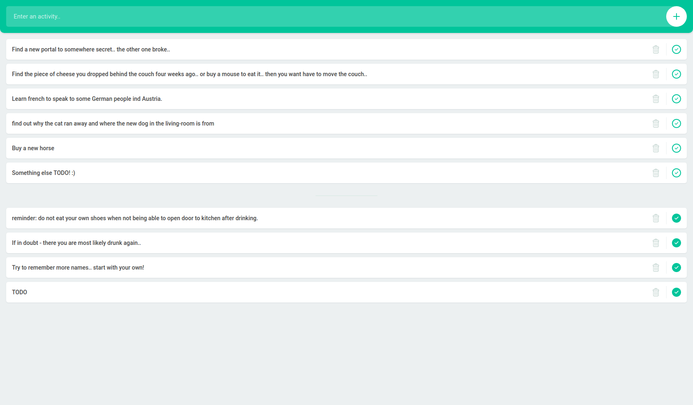

## Those who cant do - do Todo-List tutorial's :triumph:

This is my first attempt of playing with some [vanilla javascript](http://vanilla-js.com/) and doing a bit of ***localStorage***.

 

## Try this :poop: out! 

See the application live [here](https://bjavascripter.github.io/Todo-List/)

## Project Info

 No ***Task-Manager*** was needed. The ***Favicon*** is embedded in the HTML as ***BASE64*** Very basic stuff with plain ***CSS*** and as mentioned ***Vanilla Javascript***.

